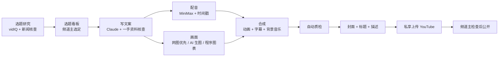

# 资产增长计划：AI 自动化 YouTube 理财频道工作流

把一个 YouTube 理财频道从「选题 → 写稿 → 配音 → 画面 → 字幕 → 封面 → 上传」尽量交给 AI 自动完成的一整套工作流。频道主只需要做两件事：在选题看板上选定题目，以及在 YouTube 上最后检查一遍再公开。

- 频道：「資產增長計劃」，繁体中文理财科普，受众是想学投资的普通人
- 搭建时间：2026-10-08（一天内从零搭到第一期视频上传）
- 主要工具：Claude Code（总指挥、写稿、核查事实）、YouTube Data API、MiniMax 配音、Abo AI 生图、vidIQ 选题数据、ffmpeg + Pillow 合成

> 日常怎么用，请看 [使用手册.md](使用手册.md)。本文写的是**整个工作流是怎么搭起来的、为什么这样设计、踩过哪些坑**。

---

## 目录

1. [整体工作流](#一整体工作流)
2. [用到的工具与分工](#二用到的工具与分工)
3. [从零搭建：YouTube 自动上传](#三从零搭建youtube-自动上传)
4. [各个 AI 服务的接入要点](#四各个-ai-服务的接入要点)
5. [频道规范](#五频道规范)
6. [选题工具](#六选题工具)
7. [视频制作流水线](#七视频制作流水线)
8. [质量检查](#八质量检查)
9. [发布](#九发布)
10. [案例：第一期 EP001](#十案例第一期-ep001)
11. [踩过的坑（经验总结）](#十一踩过的坑经验总结)
12. [待改进与路线图](#十二待改进与路线图)
13. [文件结构](#十三文件结构)
14. [环境搭建](#十四环境搭建)
15. [安全与成本](#十五安全与成本)

---

## 一、整体工作流



**设计原则**
- **能自动就自动**：频道主选择「更自动」，制作中不设人工确认点，改用自动质检把关。
- **人只做判断**：选题和最终发布由人决定，其余交给 AI。
- **事实优先**：理财内容一旦数字错了就会失去信任。所有数据和引语都要对照一手资料，比如巴菲特股东信原文。
- **规则写成文件**：频道规范、工作日志、使用手册都放在仓库里。AI 每次开工前先读，保证每一期都一致。
- **安全默认值**：上传默认私享；密钥只放在本机，不进仓库。

---

## 二、用到的工具与分工

| 环节 | 工具 | 说明 |
|---|---|---|
| 总指挥、写文案、核查事实、写代码 | **Claude Code**（桌面版） | 文案由 Claude 直接撰写，不调用其他模型 |
| 选题数据 | **vidIQ**（claude.ai 连接器） | 关键词搜索量、竞争度、趋势；每次查询 5 点额度 |
| 新闻与事实核查 | 网络搜索 + 一手资料 | 例如伯克希尔官网的股东信 PDF |
| 配音 | **MiniMax** `speech-2.8-hd` | 音色 `Chinese_deep_voiced_male_nv1`，正常语速 1.0，同时返回时间戳 |
| 封面、场景图 | **Abo AI** `gpt-image-2` | OpenAI 兼容接口；备用 `gemini-3.1-flash-image` |
| 图表、文字卡、字幕、封面文字 | Python **Pillow** | 程序绘制，保证繁体字准确、样式统一 |
| 视频合成 | **ffmpeg** | 镜头推拉、拼接、叠加、混音、响度标准化 |
| 上传 | **YouTube Data API v3** | `videos.insert` + `thumbnails.set` |
| 选题看板 | claude.ai Artifact（网页 + 内置数据库） | 网页上选定选题，Claude 读写同一份数据 |
| 版本管理 | GitHub 私有仓库 | 每次改动自动提交并推送 |

---

## 三、从零搭建：YouTube 自动上传

### 获取 API

上传视频必须用 **OAuth 2.0**，以频道所有者的身份授权，光有 API Key 不行。

1. 用频道所属的 Google 账号登录 [Google Cloud Console](https://console.cloud.google.com)，新建一个项目。
2. 「API 和服务 → 库」：启用 **YouTube Data API v3**。
3. 「OAuth 同意屏幕」（新版界面叫 Google Auth Platform → 目标对象）：
   - 用户类型选**外部（External）**。
   - 在「测试用户」里加入频道所属的 Gmail。
4. 「凭据 → 创建 OAuth 客户端 ID」，类型选**桌面应用**，下载 `client_secret_*.json` 放到项目根目录。
5. 运行 `.venv/bin/python auth_test.py`，在浏览器里授权一次，会生成 `token.json`，里面有 refresh token。以后上传都不用再授权。

### 必须知道的限制

| 问题 | 说明 | 我们的处理 |
|---|---|---|
| 授权报错 `403 org_internal` | OAuth 同意屏幕设成了「内部」，只允许组织内账号 | 改成「外部」，并把 Gmail 加进测试用户 |
| 测试状态下 token 7 天过期 | 应用处于「测试中」时，refresh token 7 天就失效 | 重新运行 `auth_test.py`；想长期使用就把应用发布到正式版 |
| 未审核项目上传的视频被锁成私享 | 官方规定：2020-07-28 后创建、没通过合规审核的项目，通过 API 上传的视频只能是私享 | 实测私享和不公开都正常，**公开上传还没验证**。第一次公开时要确认状态没被改回私享。如有需要，可以申请 [Audit and Quota Extension](https://developers.google.com/youtube/v3/guides/quota_and_compliance_audits) |
| 上传配额 | `videos.insert` 默认每天约 100 次 | 每天上传几条完全够用 |
| 自定义缩略图 | 频道需要先完成手机号验证 | 已验证，`thumbnails.set` 可以用 |

### 测试顺序

先上传一个 5 秒的测试视频，用私享状态，再用不公开状态各传一次。传完用 `videos.list` 查一下真实状态，确认没问题后才上传正式视频。

---

## 四、各个 AI 服务的接入要点

### MiniMax（配音）

- 接口：`POST https://api.minimax.cn/v1/t2a_v2`，`Authorization: Bearer <Token Plan key>`。
- Token Plan 的密钥和按量付费的密钥不通用。文本、图片、语音共用同一份额度。
- 参数：
  - `subtitle_enable: true` 会返回时间戳。
  - `subtitle_type: "word"` 返回的是逐字时间戳。
  - `pronunciation_dict` 用来修正多音字，例如 `增長/(zeng1)(zhang3)`。
  - `language_boost: "Chinese"`。
- **实用技巧**：返回的时间戳文件里有 `pronounce_text`，也就是实际朗读的文本。数字会被转成读法，比如「10%」变成「百分之十」，「114.75美元」变成「一百一十四点七五美元」。不用听音频，也能逐段检查数字读得对不对。
- **坑**：
  - 逐字时间戳看起来是平均分配的，不是按真实发音对齐，会导致字幕轻微不同步（见第十二节）。
  - 中文每个字按约 2 个计费字符算。
  - 并发请求时偶尔失败，要能重试。
- 音乐生成接口（`music_generation`）**已经不对新用户开放**，所以背景音乐改用程序合成（`pipeline/bgm_synth.py`）。

### Abo AI（生图）

- OpenAI 兼容接口：`POST https://api.aboai.ai/v1/images/generations`（[文档](https://docs.aboai.ai/api-422631133)）。
- `gpt-image-2`：
  - **必须传 `quality` 参数**。不传时实测 4 次全部返回 500；传了以后 7 次成功 6 次。
  - `size: "1536x1024"` 可以出横版图。
  - 耗时：`low` 约 20 秒，`auto` 约 25 秒，`high` 约 2 分钟。
  - 偶尔返回 500，要能自动重试。
- `gemini-3.1-flash-image`：很稳定，出 1408×768 的图，不需要传 `size`，适合当备用。
- `gpt-image-2` 可能拒绝生成某些儿童题材，这时会自动切换到 Gemini。
- 同一个接口也能做语音转写：在 `chat/completions` 里传 `input_audio`，用 `gemini-3.1-pro-preview` 来做配音的读音检查和音画同步检查。

### vidIQ（选题数据）

- 在 claude.ai 里以连接器的形式接入，Claude 可以直接调用。
- `vidiq_keyword_research`：每次查询扣 5 点，加上 `country: "TW"` 可以拿到台湾地区的数据。
- **注意**：中文长尾词的数据很少，很多显示「少于 750」。核心词的数据可信度较高。
- 免费额度每月约 150 点，所以选题研究设了上限：每次最多用 60 点。

### Claude（文案与指挥）

- 文案由 Claude 直接撰写。写之前先读一手资料，写完逐条核对数字和引语。
- 规则、偏好、反馈都写进仓库里的文件和 Claude 的长期记忆，跨会话也能保持一致。

---

## 五、频道规范

完整版在 [YouTube视频准则.md](YouTube视频准则.md)，摘要如下：

| 项目 | 规范 |
|---|---|
| 制作标准 | 内容要深入，每期都是完整的作品，让想学投资的人能看懂；力求做到**快乐、知识、共鸣、节奏** |
| 时长 | 5～15 分钟（正常语速每分钟约 250 字，文案约 1250～3500 字） |
| 语言 | 标题、封面、字幕、描述、标签一律用**繁体中文** |
| 标题 | 尽量写长（40～70 字）、体现**利他**（看完能得到什么）、吸引点击，钩子放在前 20～30 字；**不做标题党** |
| 字幕 | 思源黑体繁体粗体 56px，白字、3px 黑描边、60% 黑色投影，放在底部居中，每行最多 16 字 |
| 封面 | 1280×720；放视频主题里的人物，在左侧或右侧；深色背景；2～3 行粗体字，配色用白加红或白加黄；文字由程序叠加 |
| 画面素材 | **优先用网上可商用的图片**（公有领域、CC 授权、Unsplash、Pexels），找不到再用 AI 生成；图表由程序绘制 |
| 文案 | 由 Claude 撰写；口语化，适合朗读 |
| 配音 | MiniMax 低沉男声，**正常语速，不加速** |
| 合规 | 不荐股、不承诺收益；引语必须真实存在，不编造名人语录；AI 生成内容上传时要披露 |
| 上传 | 先私享上传，检查无误后再公开 |

封面风格的参考图在 `参考封面/`。

---

## 六、选题工具

### 选题看板（网页）

链接：https://claude.ai/artifact/94yFuzpcBPWDoVWWdAbdCf （**目前是私有的**，要分享给同事，需要频道主在页面的分享菜单里开放）。

- 选题按评分从高到低排列。每个选题显示：长标题、切入角度、月搜索量、竞争度、趋势、时效截止日，以及为什么现在做、风险、资料来源。
- 点「**选这个做下一期**」，状态会变成「已选定」，制作流程会读取它。
- 状态流转：候选 → 已选定 → 制作中 → 已发布，不做的改为放弃。
- 页面源码在 `tools/选题看板.html`，数据存在看板自带的数据库里，网页和 Claude 读写的是同一份数据。

### 评分公式

```
总分 = 需求 × 35% + 低竞争 × 25% + 趋势 × 15% + 频道契合 × 25%

需求     = vidIQ 搜索量分数（0～100）；用「代理词」估算时打 8 折
低竞争   = 100 − vidIQ 竞争度
趋势     = 50 + 增长率 ÷ 4（限制在 0～100）；无数据或代理词记 50
频道契合 = Claude 判断（受众、深度、系列衔接、合规风险）
```

「代理词」指选题本身查不到搜索数据，只好用相近关键词的数据代替。看板上会标出来，分数仅供参考。

### 选题研究流程

写成了项目 Skill：`.claude/skills/topic-research/SKILL.md`。对 Claude 说「**跑一次选题**」就会执行：

1. 读出看板现有的选题，不重复新建，也不改频道主已经设好的状态。
2. 检查 vidIQ 额度，每次最多用 60 点。
3. 用 vidIQ 查核心关键词和发散关键词。
4. 时事类选题用网络搜索核实最新进展。各家说法有冲突时，写进风险栏。
5. 按标题规则写标题，计算评分，批量写入看板。
6. 在工作日志里记一笔，然后推送到 GitHub。

每次研究的原始数据和评分脚本都保存在 `tools/选题研究/<日期>/`，以后可以回溯。

第一轮研究（2026-10-08）一共产出 18 个选题，排名前三的是：
- 加密货币新手指南（74 分）
- Anthropic 上市（69 分，时事，要在 11 月前发布）
- 《金钱心理学》（69 分）

---

## 七、视频制作流水线

### 每期一个文件夹

```
videos/EP001_巴菲特給普通人的投資建議/
├── 01_文案/        script.json（制作用：段落 + 画面安排）、文案.md（阅读用）
├── 02_配音/        segments/（逐段 mp3 + 时间戳）、voice_full / bgm / mix.wav
├── 03_画面素材/    场景图/（+ prompts.json）、图表/（预览）、graphics.json（图表规格）
├── 04_字幕/        EP001.srt
├── 05_封面/        主封面、备选封面、封面背景
├── 06_成片/        成片 mp4
├── 07_发布信息/    标题（含备选）、描述（章节 + 资料来源）、标签、upload.json、chapters.txt
├── 99_工作文件/    sources/（一手资料原文）、渲染中间文件
└── 说明.md
```

### 制作步骤

| 步骤 | 脚本 / 做法 | 产出 |
|---|---|---|
| 1. 研究与核查 | Claude 读一手资料，例如伯克希尔股东信 PDF，用 `pdftotext` 抽出文字 | `99_工作文件/sources/` |
| 2. 写文案 | Claude 写成 `script.json`：每段都标好要配的画面 | 文案与画面安排 |
| 3. 配音 | `pipeline/tts_episode.py`：逐段合成，并发请求，失败自动重试 | mp3 + 逐字时间戳 |
| 4. 场景图 | `pipeline/images_episode.py`：先 `gpt-image-2`，失败后用 Gemini；所有场景用统一的插画风格 | 场景图 PNG |
| 5. 图表与文字卡 | `pipeline/graphics.py`：Pillow 逐帧绘制动画，包括柱状图、折线图、圆环图、数字计数、引语卡、章节卡 | 动画片段 |
| 6. 合成 | `pipeline/assemble.py`：场景图镜头推拉、按段落时间排画面、字幕轨、背景音乐（人声出现时自动压低）、水印、淡入淡出、响度统一到 -14 LUFS | 成片、SRT、章节时间 |
| 7. 封面 | `cover.py`：AI 生成人物和背景，再由程序叠加繁体字 | 1280×720 封面 |
| 8. 发布信息 | 标题、描述（含章节和资料来源）、标签 | `07_发布信息/` |

### 关键设计

- **有两个画面的段落**：在最接近中点的句子停顿处切换，不在一句话中间换画面。
- **帧数计算**：帧数按画面在时间线上的绝对位置取整，不按每个片段各自取整。否则误差累积，会造成音画不同步。
- **字幕安全区**：所有图表内容都在 y=860 以上，下面留给字幕。
- **背景音乐**：有人声时约 -22dB，没有人声时约 -12dB，切换有 0.4 秒的平滑过渡。

---

## 八、质量检查

| 检查项 | 方法 |
|---|---|
| 数字读音 | 检查配音返回的 `pronounce_text`（实际朗读文本） |
| 多音字 | 用 Gemini 把可疑段落转写成文字核对 |
| 画面 | 全片均匀抽 18 帧拼成总览图，看字幕有没有压到图表、有没有乱码、水印位置对不对 |
| 场景图 | 所有场景图拼成缩略图总览，检查风格是否统一、有没有乱码文字 |
| 音画同步 | 截一段音频转写，和 SRT 字幕对照时间 |
| 规格 | 1920×1080、30fps、视频与音频时长一致、响度 -14 LUFS |
| 事实 | 每个数字和引语都对得上原文出处；翻译时删节了的引语标注「節譯」 |

---

## 九、发布

```bash
.venv/bin/python upload.py 成片.mp4 --title "標題" \
  --description-file 07_发布信息/描述.txt --tags-file 07_发布信息/标签.txt \
  --language zh-Hant --privacy private --ai-generated --thumbnail 05_封面/封面.jpg
```

- 默认私享上传，频道主在 Studio 检查后再改成公开。
- 也支持 `--publish-at` 定时公开，以及 `--privacy unlisted`。
- 自动设置「非儿童内容」和教育分类。
- 描述里放章节时间点，YouTube 会自动显示成进度条上的分段。

---

## 十、案例：第一期 EP001

**《巴菲特給普通人的投資建議：他在遺囑裡只交代了這件事》**

- **时长**：12 分 30 秒，10 个章节。
- **画面**：81 个，包括 38 张 AI 场景图和 43 个动态图表、文字卡与章节卡。
- **字幕**：361 条。
- **主线**：巴菲特的遗嘱写的是「90% 标普 500 指数基金加 10% 短期公债」。以此为开头，依次讲农场的故事、指数基金是什么、百万美元赌局、费用的威力、11 岁买第一支股票、最难的那件事、时间的秘密，最后总结成三条原则。
- **事实核查**：对照了巴菲特 1993、2013、2017、2018 年的股东信原文，修正了 AI 初稿和网上流传的错误。比如「复利是世界第八大奇迹」常被说成是巴菲特说的，实际上没有出处；Housel 的财富数字也改用了他原文里的版本。
- **上传**：2026-10-08 私享上传，视频 ID `NTOwtXiSojg`。

---

## 十一、踩过的坑（经验总结）

| 坑 | 解决 |
|---|---|
| OAuth 报错 `403 org_internal` | 同意屏幕改成「外部」，并加测试用户 |
| `gpt-image-2` 经常返回 500 | 一定要传 `quality`，失败自动重试，并准备 Gemini 作为备用 |
| Homebrew 版 ffmpeg 没有 `drawtext` 和 `subtitles` 滤镜 | 字幕和文字改用 Pillow 画成 PNG，再用 `overlay` 叠加 |
| 字幕一闪而过 | 设最短显示时间；太短的字幕合并到下一条（但这会让后面的字幕变晚，见第十二节） |
| 音画越来越不同步 | 帧数改成按时间线的绝对位置计算 |
| 用 `np.convolve` 处理 3000 万个采样点卡死 | 改用累加和做移动平均 |
| ffconcat 找不到文件 | 列表里的相对路径是相对于列表文件本身的，改用绝对路径 |
| 图表压住字幕 | 规定字幕安全区：内容不超过 y=860 |
| MiniMax 音乐接口停止对新用户开放 | 用程序合成背景音乐 |
| 简体思源黑体显示繁体字时字形不对 | 安装思源黑体**繁体版（TC）** |
| 成片超过 GitHub 100MB 上限 | mp4、wav、mov 加进 `.gitignore`，只保存在本机 |
| vidIQ 的中文长尾数据少 | 标为「代理词」，分数打折 |

---

## 十二、待改进与路线图

**频道主对 EP001 的反馈（从 EP002 开始改）**

1. 文字出现的动画不够流畅。
2. 动态图表的设计有待提升。
3. 字幕和语音轻微不同步。原因是 MiniMax 的逐字时间戳是平均分配的，再加上最短显示时间把后面的字幕往后推。改进方向是用语音识别做强制对齐，出片前自动抽查时间差。
4. 配音改回正常语速。EP001 用的是 1.1 倍，已经改成 1.0。
5. 图片优先在网上找可商用的，减少 AI 生图的费用。
6. 标题写得更长、更利他。

**接下来要做**

- **一键制作 Skill**：在看板选定选题后，自动完成研究、文案、配音、画面、合成、质检、上传，全程不需要人工确认。
- **网络找图**：从 Wikimedia Commons、Pexels 等图库找图，并记录授权。
- **升级图表与动画**，并做**字幕强制对齐**。
- **可选**：每周定时自动跑一次选题研究。

每天的进展与反馈记录在 [工作日志.md](工作日志.md)。

---

## 十三、文件结构

| 位置 | 内容 |
|---|---|
| `README.md` | 本文：工作流全貌 |
| `使用手册.md` | 日常使用说明（对 Claude 说什么、链接、常见问题） |
| `YouTube视频准则.md` | 频道规范 |
| `工作日志.md` | 按日期记录进展、反馈、待改进 |
| `选题关键词.md` | 核心关键词与发散关键词 |
| `pipeline/` | 视频制作脚本（`tts_episode.py`、`images_episode.py`、`graphics.py`、`assemble.py`、`bgm_synth.py`） |
| `tools/` | 选题看板源码、选题研究数据 |
| `.claude/skills/topic-research/` | 选题研究 Skill |
| `videos/EPxxx_*/` | 每期视频的全部素材 |
| `upload.py` / `auth_test.py` | YouTube 上传与授权 |
| `cover.py` / `tts_minimax.py` / `config.py` | 封面、单段配音、读取配置 |
| `参考封面/` | 封面风格参考 |

---

## 十四、环境搭建

```bash
python3 -m venv .venv
.venv/bin/pip install -r requirements.txt
cp .env.example .env   # 然后填入真实密钥
```

还需要：

- 从 Google Cloud 下载 OAuth 桌面客户端的 `client_secret_*.json`，放到项目根目录，然后运行 `.venv/bin/python auth_test.py` 授权（见第三节）。
- 安装思源黑体繁体版 Bold 和 Heavy（`SourceHanSansTC-Bold.otf`、`SourceHanSansTC-Heavy.otf`）到 `~/Library/Fonts/`，可以从 [Adobe 官方 GitHub](https://github.com/adobe-fonts/source-han-sans/releases) 下载。
- `ffmpeg`（Homebrew 版即可）和 `pdftotext`（用于读取资料 PDF）。
- matplotlib、numpy 和 Pillow 由 pip 安装。
- vidIQ 需要在 claude.ai 里连接。

---

## 十五、安全与成本

**安全**
- 所有密钥都在 `.env`、`token.json` 和 `client_secret_*.json` 里，这三个文件已经写进 `.gitignore`，**绝不提交**。仓库里只放不含密钥的 `.env.example`。
- 每次提交前自动扫描暂存区，确认没有密钥混进去。
- 上传默认私享。
- 仓库是私有的。仓库里有其他频道的封面参考图，还有 AI 生成的真人肖像，如果要改成公开，需要先删掉这两类文件。

**成本与额度（以 EP001 为参考）**
- **MiniMax**：约 3500 字的文案，按中文每字约 2 个计费字符，从 Token Plan 额度里扣。
- **Abo AI**：38 张场景图加 1 张封面背景。以后改成网图优先，可以大幅减少。
- **vidIQ**：一次选题研究约 50 点，每月免费额度约 150 点。
- **YouTube API**：免费，上传每天约 100 次的配额。
